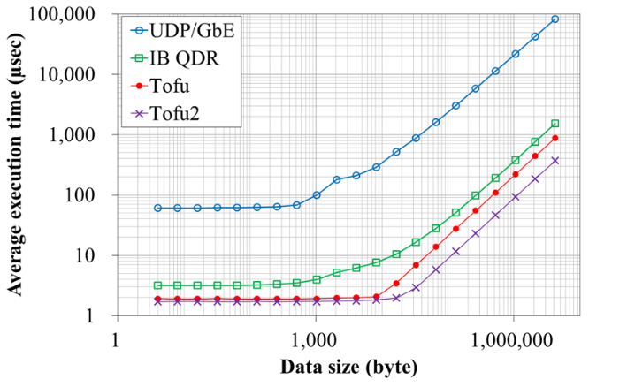

# Team Description

* Pl: Takeshi Nanri (Kyushu University)
* co-Pl: Shinji Sumimoto (Fujitsu Ltd.) and Hidetomo Shibamura (ISIT)
* Research Period: 2011 - 2017
* [Research highlights in pdf]({{ site.baseurl }}/images/crest-nanri.pdf)
* Research website: [http://ace-project.kyushu-u.ac.jp/](http://ace-project.kyushu-u.ac.jp/)

# Published Software

* [Advanced Communication Primitives (ACP) Library](https://github.com/project-ace/ACP)

---

# PGAS-based Scalable Communication Library ACP, and it's Applications

## ACP (Advanced Communication Primitives): a PGAS-based Communication Library

ACP supports a communication model that transfers data via "Global Memory", that is a virtual memory space managed by the library. Each process can expose a region of its local memory to other processes by registering that region to the global memory.

### Basic Layer: Global Memory Access Operations of ACP

#### Copy operation

Copy data from one place in the Global Memory to another. Internally, the library performs appropriate communication operations for each copy operation so that the data is transferred between corresponding registered regions of local memories.

#### Atomic operation

Permutation, increment/decrement and logarithmic operations, on the value stored in the specified place of the Global Memory.

### Fundamental Performance of ACP

#### Local to Remote

#### Remote to Local

#### Remote to Remote

### Estimated Memory Consumption of ACP

#### Estimation with 1,000,000 processes:

|           | send-receive with 1KB buffer    | ACP on InfiniBand | ACP on Tofu/Tofu2 | ACP on Ethernet |
| --------- | ------------------------------- | ----------------- | ----------------- | --------------- |
| Memory    |                            10GB |             370MB |            67MB   |       34MB      |

### Middle Layer: Additional Operations of ACP

#### Communication Library

Explicit creation / free of channels among processes that support one-directional send / receive.

#### Data Library

Create / modify / destruct data structures, such as vector, list, deque map and set, on the Global Memory.

### ACP + MPI

Existing MPI programs can call ACP. Also, ACP can be used to connect multiple MPI programs to reduce memory consumption by communicators of MPI

### Network Simulator NSIM-ACE

Study behavior of one-sided communications performed with ACP. Packets are generated automatically, and simulated according to the configuration of networks and the pseudo code.

